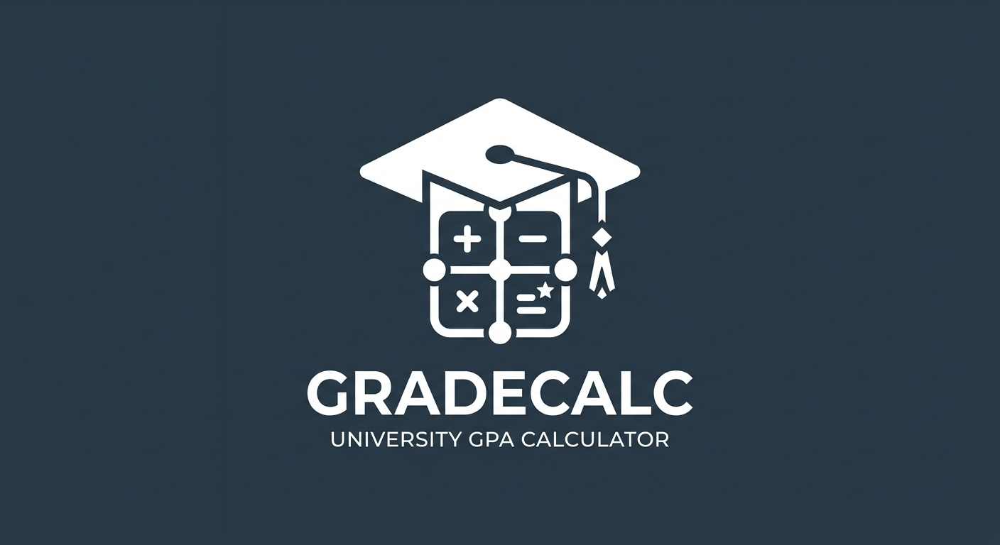

<div align="center">
  
  <h1>🎓 CGPA & SGPA Calculator</h1>
  <p>A clean, modern web application for university students to calculate their Semester Grade Point Average (SGPA) and Cumulative Grade Point Average (CGPA).</p>
</div>

## ✨ Features

- **Multi-Semester Tracking**: Navigate between multiple semesters seamlessly and see your overall CGPA instantly recalculate.
- **Subject & Credit Management**: Add, update, and remove subjects dynamically per semester.
- **Theory vs. Practical**: Built-in support for different assessment structures:
  - **Theory**: Internal (30), Midterm (50), and End-Semester (100) calculations scaled to a standard 100-point total.
  - **Practical**: Standard 100-point assessment.
- **Optional Subjects**: Easy toggle to indicate optional subjects that shouldn't impact credit totals.
- **Real-Time Grade Calculation**: Grade points and letter grades (O, A+, A, etc.) calculate instantly, updating the sticky bottom results board.

## 🧮 How It Works (The Logic)

The calculator uses a standard university grading progression algorithm.

### 1. Score Normalization
- **Theory Subjects**: 
  - Internal marks are capped at `30`.
  - MidTerm marks (out of 50) are scaled down to `20%` weightage: `(MidTerm / 50) * 20`.
  - EndSem marks (out of 100) are scaled down to `50%` weightage: `(EndSem / 100) * 50`.
  - *Total Score = Internal + (MidTerm Scaled) + (EndSem Scaled)*.
- **Practical Subjects**: Total marks are taken directly out of `100`.

### 2. Grade Points & Letter Grades
The 100-point total score is mapped to a standard 10-point scale:
- `90 - 100` ➔ **10** (O)
- `80 - 89` ➔ **9** (A+)
- `70 - 79` ➔ **8** (A)
- `60 - 69` ➔ **7** (B+)
- `50 - 59` ➔ **6** (B)
- `40 - 49` ➔ **5** (C)
- `< 40` ➔ **0** (F - Fail)

### 3. SGPA (Semester GPA)
```math
SGPA = Σ (Subject Credits × Grade Point) / Σ (Credits)
```
*(Optional subjects are automatically excluded from both numerator and denominator)*

### 4. Overall CGPA
```math
CGPA = Σ (Semester SGPA × Semester Credits) / Σ (Total Credits Across Semesters)
```

## 👨‍💻 Developer Information

- **Developer Name**: Rehan97
- **GitHub**: [@ft976](https://github.com/ft976)
- **LinkedIn**: [Rehan Ahmad](https://www.linkedin.com/in/rehan-ahmad-863386382)

## 🚀 Local Development

1. Clone the repository.
2. Install dependencies:
   ```bash
   npm install
   ```
3. Start the development server:
   ```bash
   npm run dev
   ```
4. Build for production:
   ```bash
   npm run build
   ```

## 🌐 Deploy to Vercel

This app is built with standard Vite + React and is completely ready to be deployed on Vercel with zero additional configuration.

[](https://vercel.com/new)

**To deploy:**
1. Push your code to a GitHub repository.
2. Log in to [Vercel](https://vercel.com) and click **Add New Project**.
3. Import your GitHub repository.
4. Leave the default Vite build commands (`npm run build` and `dist` output directory).
5. Click **Deploy**.
